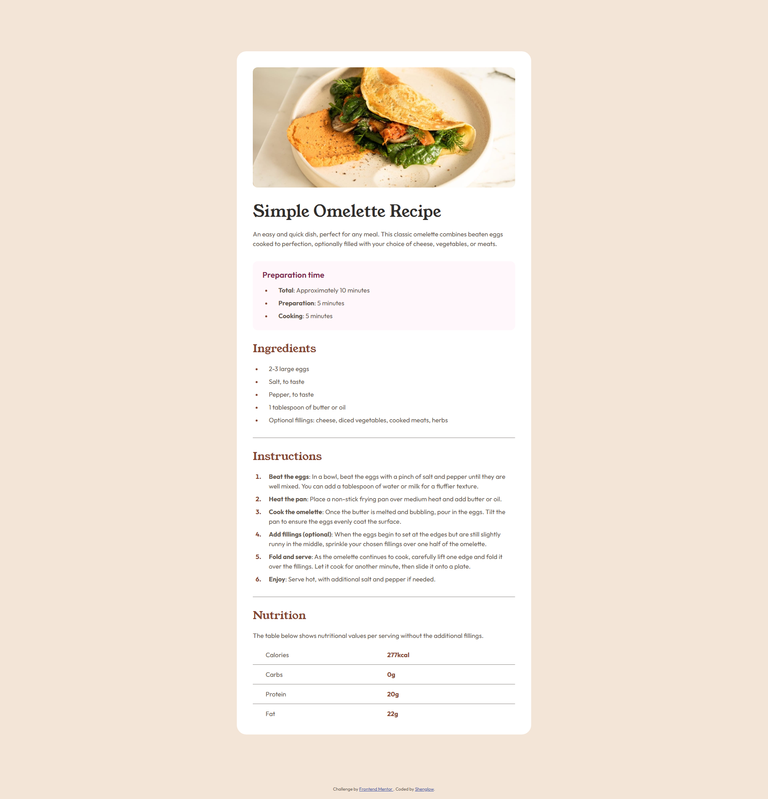

# Frontend Mentor - Recipe page solution

This is a solution to the [Recipe page challenge on Frontend Mentor](https://www.frontendmentor.io/challenges/recipe-page-KiTsR8QQKm). Frontend Mentor challenges help you improve your coding skills by building realistic projects.

## Table of contents

- [Overview](#overview)
  - [Screenshot](#screenshot)
  - [Links](#links)
- [My process](#my-process)
  - [Built with](#built-with)
  - [What I learned](#what-i-learned)

## Overview

### Screenshot



### Links

[Live Demo](https://shenglow.github.io/recipe-page/)

## My process

### Built with

- Semantic HTML5 markup
- CSS custom properties

### What I learned

In this challenge, I learned more about the usage of `dd` element. For example, when presenting information in a simple table without headers, using the `dd` element is more appropriate.

```html
<dl>
  <dt>Calories</dt>
  <dd>277kcal</dd>
</dl>
<dl>
  <dt>Carbs</dt>
  <dd>0g</dd>
</dl>
<dl>
  <dt>Protein</dt>
  <dd>20g</dd>
</dl>
```
